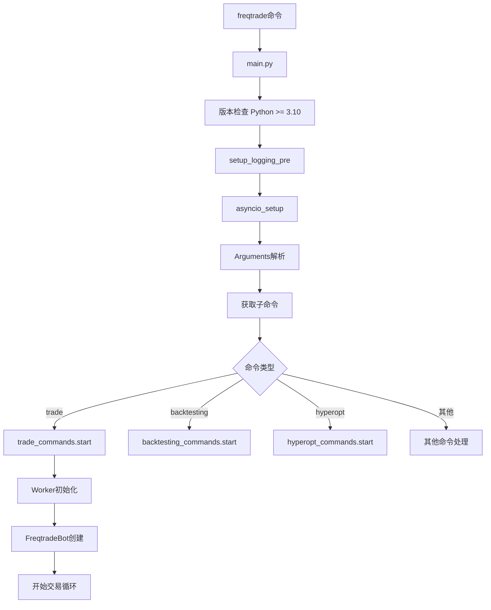
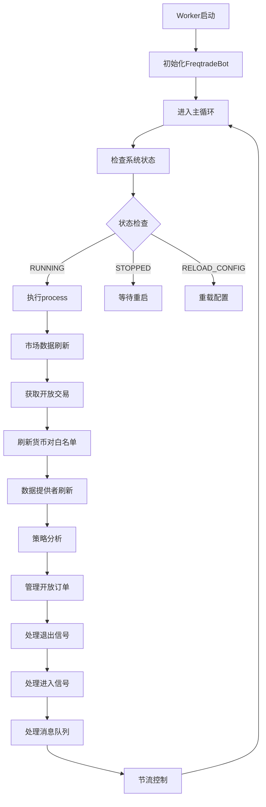
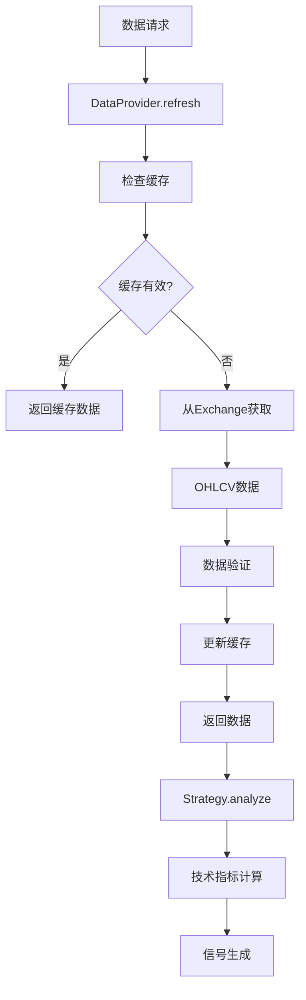
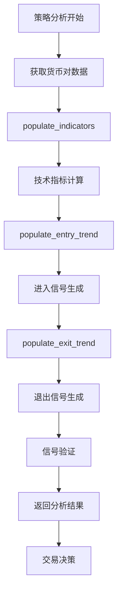
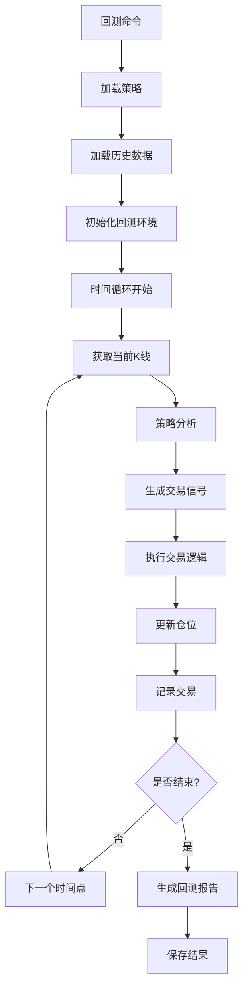
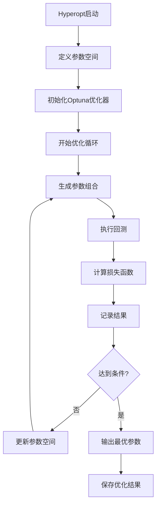
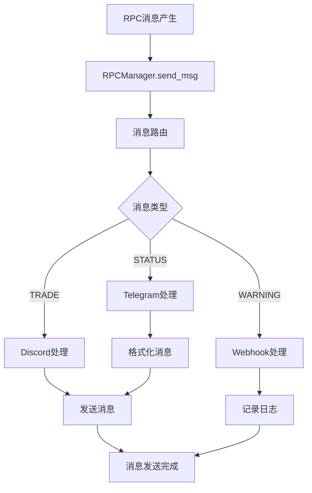
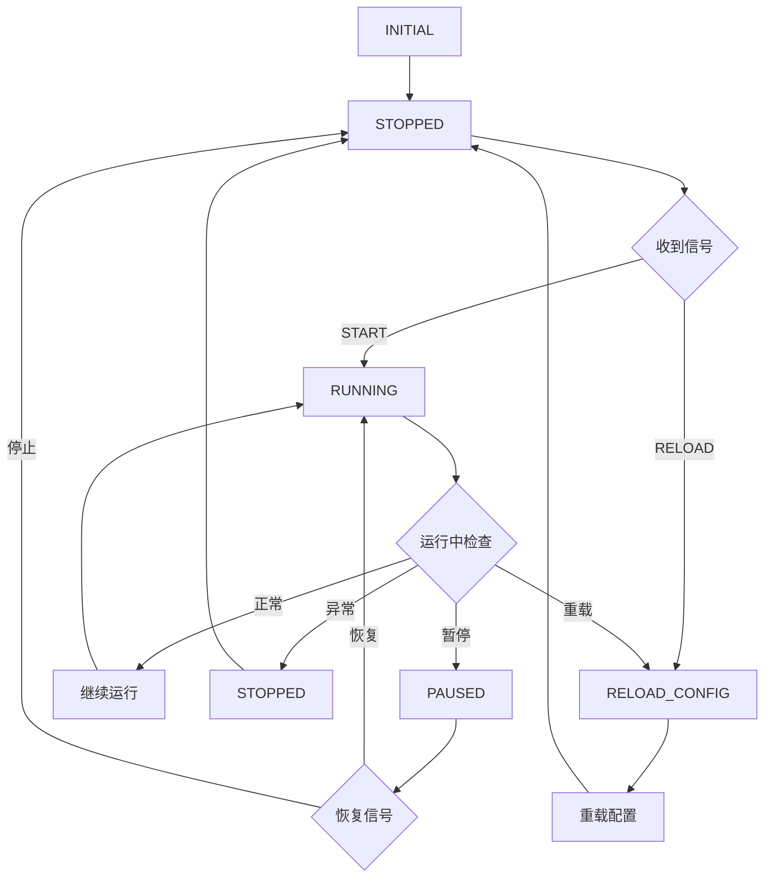
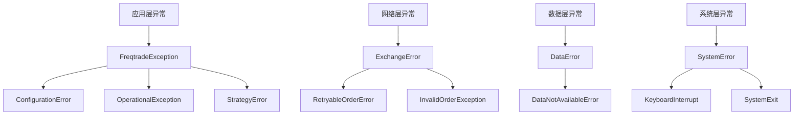
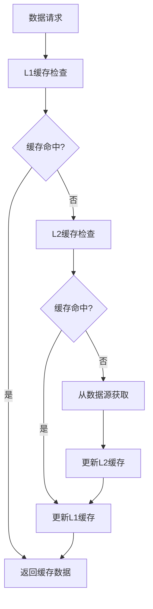

# FreqTrade 执行流程图与说明

## 目录
- [1. 系统启动流程](#1-系统启动流程)
- [2. 交易执行流程](#2-交易执行流程)
- [3. 数据处理流程](#3-数据处理流程)
- [4. 策略执行流程](#4-策略执行流程)
- [5. 回测流程](#5-回测流程)
- [6. 超参数优化流程](#6-超参数优化流程)
- [7. RPC通信流程](#7-rpc通信流程)
- [8. 状态机流程](#8-状态机流程)

## 1. 系统启动流程

### 1.1 启动流程图



### 1.2 详细启动步骤

1. **程序入口** (`main.py:main()`)
   - 检查Python版本 (>= 3.10)
   - 设置预备日志系统
   - 初始化asyncio环境
   - 设置垃圾回收阈值

2. **参数解析** (`Arguments类`)
   - 解析命令行参数
   - 验证子命令
   - 构建配置字典

3. **命令分发**
   - 根据`func`属性调用对应处理函数
   - 传递解析后的参数

4. **交易模式启动** (`trade_commands.start()`)
   - 创建Configuration实例
   - 初始化Worker
   - 启动交易循环

## 2. 交易执行流程

### 2.1 交易主循环流程图



### 2.2 FreqtradeBot.process() 详细流程

```python
def process(self) -> None:
    """
    主处理循环 - 每个周期执行的核心逻辑
    """
    # 1. 刷新市场数据
    self.exchange.reload_markets()
    
    # 2. 获取活跃交易
    trades = Trade.get_open_trades()
    
    # 3. 刷新货币对白名单
    self.pairlists.refresh_pairlist()
    
    # 4. 刷新K线数据
    self.dataprovider.refresh(self.pairlists.whitelist)
    
    # 5. 策略分析
    strategy_safe_wrapper(self.strategy.analyze, logger)(self.dataprovider)
    
    # 6. 管理开放订单
    self.manage_open_orders()
    
    # 7. 处理退出位置
    self.exit_positions(trades)
    
    # 8. 处理进入位置
    self.enter_positions()
    
    # 9. 处理消息队列
    self.rpc.process_msg_queue()
```

## 3. 数据处理流程

### 3.1 数据获取流程图



### 3.2 数据缓存机制

```python
class DataProvider:
    def __init__(self, config: Config, exchange: Exchange):
        self.__cached_pairs: Dict[PairWithTimeframe, Tuple[DataFrame, datetime]] = {}
        self.__cached_pairs_backtesting: Dict[PairWithTimeframe, DataFrame] = {}
        self._refresh_length = config.get('refresh_length', 50)
    
    def refresh(self, pairlist: List[str]):
        """刷新数据缓存"""
        for pair in pairlist:
            for timeframe in self._timeframes:
                self._refresh_pair_data(pair, timeframe)
```

## 4. 策略执行流程

### 4.1 策略分析流程图



### 4.2 策略接口实现

```python
class IStrategy(ABC):
    @abstractmethod
    def populate_indicators(self, dataframe: DataFrame, metadata: dict) -> DataFrame:
        """
        计算技术指标
        在这里添加所有需要的技术指标
        """
        pass
    
    @abstractmethod
    def populate_entry_trend(self, dataframe: DataFrame, metadata: dict) -> DataFrame:
        """
        生成进入信号
        基于技术指标设置 'enter_long' 或 'enter_short' 列
        """
        pass
    
    @abstractmethod
    def populate_exit_trend(self, dataframe: DataFrame, metadata: dict) -> DataFrame:
        """
        生成退出信号
        基于技术指标设置 'exit_long' 或 'exit_short' 列
        """
        pass
```

## 5. 回测流程

### 5.1 回测执行流程图



### 5.2 回测核心逻辑

```python
class Backtesting:
    def backtest(self, processed: Dict) -> Dict:
        """
        回测主逻辑
        """
        # 1. 初始化回测环境
        self._set_strategy(processed)
        
        # 2. 时间循环
        for row in itertuples(processed['data']):
            # 3. 策略分析
            signal = self.strategy.analyze(row)
            
            # 4. 处理交易信号
            trades = self._get_trade_signal(signal)
            
            # 5. 执行交易
            for trade in trades:
                self._execute_trade(trade)
        
        # 6. 生成统计报告
        return self._get_trade_stats()
```

## 6. 超参数优化流程

### 6.1 Hyperopt执行流程图



### 6.2 Hyperopt核心实现

```python
class Hyperopt:
    def start(self) -> None:
        """开始超参数优化"""
        # 1. 创建Optuna研究
        study = optuna.create_study(
            direction='maximize',
            sampler=optuna.samplers.TPESampler()
        )
        
        # 2. 开始优化
        study.optimize(self._objective, n_trials=self.config['epochs'])
        
        # 3. 保存结果
        self._save_results(study)
    
    def _objective(self, trial) -> float:
        """优化目标函数"""
        # 1. 生成参数
        params = self._generate_params(trial)
        
        # 2. 运行回测
        results = self.backtesting.backtest(params)
        
        # 3. 计算损失
        return self.hyperopt_loss.hyperopt_loss_function(results)
```

## 7. RPC通信流程

### 7.1 RPC消息处理流程图



### 7.2 RPC架构设计

```python
class RPCManager:
    def __init__(self, freqtrade: FreqtradeBot):
        self.rpc = RPC(freqtrade)
        self._rpc_handlers: List[IRPCHandler] = []
        
        # 初始化不同的RPC处理器
        if config.get('telegram', {}).get('enabled', False):
            self._rpc_handlers.append(Telegram(self.rpc, config))
        
        if config.get('discord', {}).get('enabled', False):
            self._rpc_handlers.append(Discord(self.rpc, config))
    
    def send_msg(self, msg: RPCMessage) -> None:
        """发送消息到所有活跃的RPC处理器"""
        for handler in self._rpc_handlers:
            handler.send_msg(msg)
```

## 8. 状态机流程

### 8.1 Worker状态机图



### 8.2 状态机实现

```python
class State(Enum):
    STOPPED = "stopped"
    RUNNING = "running"
    PAUSED = "paused"
    RELOAD_CONFIG = "reload_config"

class Worker:
    def __init__(self, args: Dict[str, Any]):
        self._init_state = State.STOPPED
        self.freqtrade = None
    
    def _worker(self) -> None:
        """主工作循环"""
        state = self._init_state
        
        while True:
            if state == State.RUNNING:
                state = self._process_running()
            elif state == State.STOPPED:
                state = self._process_stopped()
            elif state == State.RELOAD_CONFIG:
                state = self._process_reload_config()
            elif state == State.PAUSED:
                state = self._process_paused()
            
            self._throttle(timeframe=self.freqtrade.config['timeframe'])
```

## 9. 错误处理流程

### 9.1 异常处理层次图



### 9.2 异常处理机制

```python
def main(sysargv: list[str] | None = None) -> None:
    """主函数异常处理"""
    return_code: Any = 1
    try:
        # 主要逻辑
        return_code = args["func"](args)
    except SystemExit as e:
        return_code = e
    except KeyboardInterrupt:
        logger.info("SIGINT received, aborting ...")
        return_code = 0
    except ConfigurationError as e:
        logger.error(f"Configuration error: {e}")
    except FreqtradeException as e:
        logger.error(str(e))
        return_code = 2
    except Exception:
        logger.exception("Fatal exception!")
    finally:
        sys.exit(return_code)
```

## 10. 性能优化流程

### 10.1 缓存机制图



### 10.2 并行处理机制

```python
class Hyperopt:
    def start(self) -> None:
        """并行超参数优化"""
        with ProcessPoolExecutor(max_workers=self.config['jobs']) as executor:
            futures = []
            for i in range(self.config['epochs']):
                future = executor.submit(self._run_trial, i)
                futures.append(future)
            
            # 收集结果
            results = [future.result() for future in futures]
```

## 11. 总结

FreqTrade的执行流程体现了以下设计特点：

1. **清晰的分层架构**: 每个层次都有明确的职责
2. **状态机驱动**: 系统状态转换清晰可控
3. **事件驱动**: 基于事件的异步处理
4. **错误恢复**: 多层次的异常处理和恢复机制
5. **性能优化**: 缓存机制和并行处理提高效率
6. **可扩展性**: 插件化架构支持功能扩展

这些流程设计使得FreqTrade能够在复杂的交易环境中保持稳定运行，同时为用户提供灵活的配置和扩展能力。
